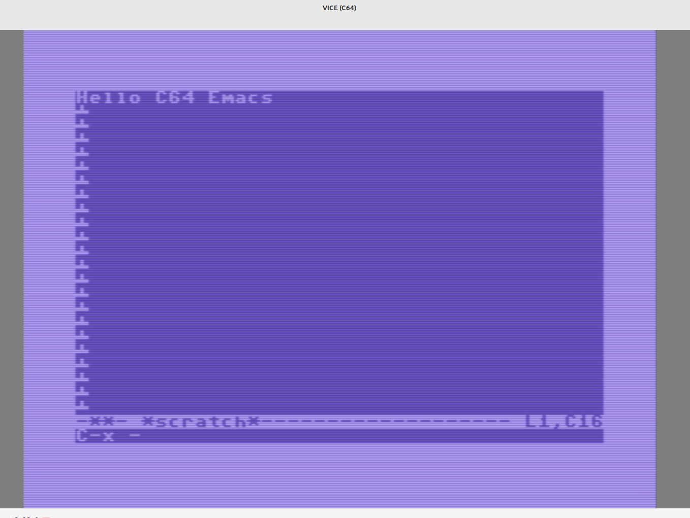

# Emacs text editor for the Commodore 64

A minimal "Just for Fun" **[Emacs](https://en.wikipedia.org/wiki/Emacs)**-style text editor for the Commodore 64, written in C and
compiled with [cc65](https://cc65.github.io/). Modeless editing with
Emacs-flavoured keybindings, mini-buffer prompts, kill/yank, and sequential
file I/O on a 1541-compatible disk drive.




---

## Requirements

[cc65 v2.19+](https://cc65.github.io/) C cross-compiler for 6502 / C64 
[VICE](https://vice-emu.sourceforge.io/) C64 emulator (`x64sc`, `c1541`)

---

## Building

Override the cc65 path with `make CC65_HOME=/your/path`.

```bash
make          # compiles emacs.prg and creates emacs_disk.d64
make clean    # remove build artefacts
make run      # build + launch in VICE (x64sc)
```

---

## Running

### In VICE
```bash
make run
```

### On a real C64
```
LOAD "EMACS",8,1
RUN
```

---

## Usage

### Movement

| Key | Action |
|-----|--------|
| `C-f` or `→` | Forward one character |
| `C-b` or `←` | Backward one character |
| `C-n` or `↓` | Next line |
| `C-p` or `↑` | Previous line |
| `C-a` or `HOME` | Beginning of line |
| `C-e` | End of line |
| `C-v` | Scroll one page down |

> **C-n note:** `CTRL+N` on a real C64 toggles the character set at the
> hardware level and may not reach the editor. Use the cursor-down key
> instead.

### Editing

| Key | Action |
|-----|--------|
| Any printable key | Insert character at cursor |
| `RETURN` | New line |
| `DEL` | Delete character to the left (backspace) |
| `C-d` | Delete character under cursor (forward delete) |
| `C-k` | Kill (cut) from cursor to end of line |
| `C-k` at end of line | Kill the newline (join with next line) |
| `C-y` | Yank (paste) the last killed text |
| `C-o` | Open line: insert blank line below without moving cursor |

### File commands - `C-x` prefix

Press **C-x** (cursor shows `C-x -` in echo area), then:

| Second key | Action |
|------------|--------|
| `s` | Save buffer to current filename |
| `w` | Write buffer to a new filename (save as) |
| `f` | Find / open a file from disk |
| `c` | Quit (asks to confirm if unsaved changes) |
| `C-g` or `RUN/STOP` | Cancel the C-x prefix |

> **Filenames** - type with unshifted keys. PETSCII 65–90 (lowercase
> display) is exactly what CBM DOS expects.

### Other commands

| Key | Action |
|-----|--------|
| `C-l` | Redraw / re-centre the screen on the cursor |
| `C-g` | Cancel current operation / dismiss echo message |
| `RUN/STOP` | Same as `C-g` |

---

## File format

Sequential (SEQ) files, lines separated by PETSCII `0x0D` (CR).
Compatible with the native C64 text format used by BASIC and most C64
utilities.

---

## Limitations

- Lines capped at **79 characters**; no horizontal scrolling.
- Maximum **200 lines** per file (~16 KB).
- Kill ring holds only **one entry** (last `C-k`).
- No search, undo, or multiple buffers.
- `C-n` (next line via Ctrl) may not work on real hardware - use `↓`.

